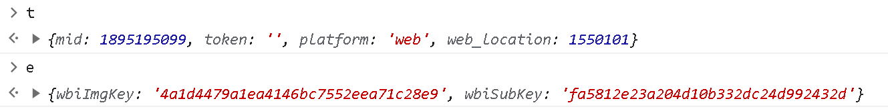

# B站UP主“江寻千”文化传播影响因素分析

能动B2104 杨牧天

## 爬虫模块

爬取江寻千发布视频的各类信息，如投币、分享、收藏数量等；视频封面，视频开头截屏，视频时长等

### 爬虫模块核心类

`Spider.py`

```python
class BiliSpider:
    def __init__(self):
        with open("config.yaml", "r") as file:
            self.yaml_data = yaml.safe_load(file)
        self.headers = self.yaml_data["headers"]
        self.save_path = self.yaml_data["save_path"]
    ... ... ... ... ... ... ... ... ...
```

爬虫由类`BiliSpider`实现，读取配置文件`config.yaml`进行爬虫配置

`config.yaml`

```yaml
# 爬虫名称
name: "MySpider"

# 爬虫主页面及子页面地址
urls:
  main_page: "https://api.bilibili.com/x/space/wbi/arc/search?"
  detail_page: "https://api.bilibili.com/x/web-interface/wbi/view?aid={aid}"

# 爬虫主页面参数
params:
  mid: 1895195099
  ps: 30
  tid: 0
  pn: 1
  keyword: ""
  order: "pubdate"
  platform: "web"
  web_location: 1550101
  order_avoided: "true"
  w_rid:
    - "8b7e4e9cb36f83e8a880d20e7434fd32"
    - "4ccdf4f501b4750272181bba2d36e60e"
    - "b9918f7af041b828eb35f707ec081dc9"
    - "5df434821002c6663103e2236e7f78a1"
    - "9d0feb7a9a95cbc02aa7a6744dd3ea7b"
    - "c0eca9247f3b6612154a404df31e6600"
  wts:
    - 1689056961
    - 1689064813
    - 1689065086
    - 1689065115
    - 1689065140
    - 1689065165

# 请求头
headers:
  User-Agent: "Mozilla/5.0 (Windows NT 10.0; Win64; x64) AppleWebKit/537.36 (KHTML, like Gecko) Chrome/88.0.4324.96 Safari/537.36 Accept-Language = en-US,en;q=0.9"

# 保存路径
save_path: "./results.json"
```

**此处的`w_rid`和`wts`为服务器加密生成，由于本项目只需爬取六页数据，因此可通过使用开发者工具依次获取。**除此之外，可以通过`JS`逆向工程对参数进行生成，详细操作将在下一部分展示

### 主页面的爬取

**主页面概览**


**爬取函数**

```python
def get_main_page(self, pn):
    main_page_url = self.yaml_data["urls"]["main_page"]
    params = self.yaml_data["params"]
    params["pn"] = pn
    params["w_rid"] = params["w_rid"][pn - 1]
    params["wts"] = params["wts"][pn - 1]
    response = requests.get(url=main_page_url, params=params, headers=self.headers)

    return response.json()
```

`get_main_page`函数用来使用`Ajax`方法爬取主页面中子页面信息；通过使用开发者工具的`xhr`功能获得地址https://api.bilibili.com/x/space/wbi/arc/search，通过配置一些`params`即可进行子页面信息的获取，其中关键参数如下：

| mid      | pn             | ps             | w_rid                | wts        |
| -------- | -------------- | -------------- | -------------------- | ---------- |
| 子页面id | 主页面当前页码 | 返回子页面数量 | 服务器生成特殊标识符 | 10位时间戳 |

**JS逆向工程**

首先，在开发者工具`search`界面中搜索`w_rid`，得到如下结果：


观察发现`w_rid`共出现三次，依次在js文件中函数的开头和结尾设置断点如下：


通过重新加载界面，在命令行中查看函数输入参数t与e，最终出现如下页面时可知t为请求参数，e未知：



使用调用堆栈可获取e的来源：


通过查看z定义处函数可合理猜测e为定值（经过检验确实如此）

因此只需解析函数的生成方式，其生成函数如下：

```javascript
for (var c = (n = i + a,
            r = [],
            [46, 47, 18, 2, 53, 8, 23, 32, 15, 50, 10, 31, 58, 3, 45, 35, 27, 43, 5, 49, 33, 9, 42, 19, 29, 28, 14, 39, 12, 38, 41, 13, 37, 48, 7, 16, 24, 55, 40, 61, 26, 17, 0, 1, 60, 51, 30, 4, 22, 25, 54, 21, 56, 59, 6, 63, 57, 62, 11, 36, 20, 34, 44, 52].forEach((function(t) {
                n.charAt(t) && r.push(n.charAt(t))
            }
            )),
            r.join("").slice(0, 32)), u = Math.round(Date.now() / 1e3), p = Object.assign({}, t, {
                wts: u
            }), d = Object.keys(p).sort(), h = [], v = /[!'\(\)*]/g, y = 0; y < d.length; y++) {
                var m = d[y]
                  , g = p[m];
                g && "string" == typeof g && (g = g.replace(v, "")),
                null != g && h.push("".concat(encodeURIComponent(m), "=").concat(encodeURIComponent(g)))
            }
            var b = h.join("&");
            return {
                w_rid: s(b + c),
                wts: u.toString()
            }
        }
```

经测试为md5加密，使用python逆向构建生成函数为：

```PYTHON
def web_rid(self, param):
    n = "653657f524a547ac981ded72ea172057" + "6e4909c702f846728e64f6007736a338"
    c = ''.join([n[i] for i in [46, 47, 18, 2, 53, 8, 23, 32, 15, 50, 10, 31, 58, 3, 45, 35, 27, 43, 5, 49, 33, 9, 42, 19, 29, 28, 14, 39, 12, 38, 41, 13, 37, 48, 7, 16, 24, 55, 40, 61, 26, 17, 0, 1, 60, 51, 30, 4, 22, 25, 54, 21, 56, 59, 6, 63, 57, 62, 11, 36, 20, 34, 44, 52]][:32])
    s = int(time.time())
    param["wts"] = "1684737775"
    param = "&".join([f"{i[0]}={i[1]}" for i in sorted(param.items(), key=lambda x: x[0])])
    return hashlib.md5((param + c).encode(encoding='utf-8')).hexdigest(), s
```

> 输入：
>
> ```python
> spider = BiliSpider()
> print(spider.web_rid({
>         "mid": 700152,
>         "token": "",
>         "platform": "web",
>         "web_location": 1550101
>     }))
> ```
>
> 输出：
>
> ```python
> ('866f391b919610033729213b22df4219', 1689090131)
> ```

### 主页面解析

**解析函数**

```python
def parse_main_page(self, json_data):
    video_list = json_data["data"]["list"]["vlist"]
    aid_list = [video["aid"] for video in video_list]
    length_list = [video["length"] for video in video_list]

    return aid_list, length_list
```

通过观察返回的`json`数据结构获取子页面`aid`和视频时长

### 子页面爬取

**子页面地址构建**

```python
def create_detail_url(self, aid):
    detail_url = self.yaml_data["urls"]["detail_page"].format(aid=aid)

    return detail_url
```

通过使用开发者工具的`xhr`模块进入子页面发现含有子页面信息的网址，需要参数`aid`，通过主页面爬取获取`aid`后即可进行详细信息的爬取。

**子页面爬取**

```python
def get_detail_page(self, aid):
    detail_url = self.create_detail_url(aid)
    response = requests.get(detail_url, headers=self.headers)

    return response.json()
```

同主页面爬取的方法。

**子页面解析**

```python
def parse_detail_page(self, json_data):
    data = json_data["data"]
    tname = data["tname"]
    pic = data["pic"]
    title = data["title"]
    desc = data["desc"]
    stat = data["stat"]
    owner_name = data["owner"]["name"]

    if owner_name == "江寻千":
        detail_data = {
            "factor": {
                "tname": tname,
                "pic": pic,
                "title": title,
                "desc": desc
            },
            "goal": {
                "view": stat["view"],
                "danmaku": stat["danmaku"],
                "reply": stat["reply"],
                "favorite": stat["favorite"],
                "coin": stat["coin"],
                "share": stat["share"],
                "like": stat["like"]
            }
        }
    else:
        return None
    return detail_data
```

将爬取到的子页面数据进行处理，生成初步的结构化数据。

**数据合并**

```python
def merge_data(self, length_datas, detail_datas):
    def change_to_second(time_string):
        split_string = time_string.split(":")
        minute = int(split_string[0])
        second = int(split_string[1])
        return minute * 60 + second
    length_datas = [change_to_second(length) for length in length_datas]

    result_data = []
    for length, detail in zip(length_datas, detail_datas):
        if not detail:
            continue
            detail["factor"]["length"] = length
            result_data.append(detail)

    return result_data
```

将主页面中获得的时间长度数据和子页面的结构化数据合并形成结果数据。

### 主函数

```python
def main_crawl(self):
    main_result_data = []
    for page in range(1, 7):
        main_data = self.get_main_page(pn=page)
        aid_data, length_data = self.parse_main_page(main_data)
        detail_data = [self.get_detail_page(aid) for aid in aid_data]
        detail_data = [self.parse_detail_page(detail) for detail in detail_data]
        result_data = self.merge_data(length_data, detail_data)
        main_result_data.extend(result_data)

    with open(self.save_path, "w", encoding="utf-8") as file:
        json.dump(main_result_data, file, indent=3, ensure_ascii=False)
```

爬取页码范围为1-6的主页面，分别生成每个视频的结果数据，将其合并到列表中，最终依据配置文件的保存位置将数据存储。

通过运行以下代码可完成爬虫步骤：

```python
if __name__ == '__main__':
    spider = BiliSpider()
    spider.main_crawl()
```

## 数据收集模块

由于视频封面使用计算机编码较为困难，因此我们使用人工编码的方式对图片进行分类，根据项目的特点，我们制定了五个评价指标并将其使用GUI进行人工编码以提高其方便性。

**评价指标：**

1. 视觉吸引力（Visual Appeal）：评估封面在视觉上的吸引力和美观程度。考虑颜色搭配、构图、元素排列等因素。
2. 信息传达（Information Conveyance）：评估封面是否能够清晰地传达视频的主题、内容或情感。考虑文字、图像、符号等元素的表达是否准确和明确。
3. 情感引发（Emotional Engagement）：评估封面是否能够引发情感共鸣或兴趣。考虑封面所传达的情绪、情感色彩、与目标受众的契合程度等因素。
4. 与UP主风格一致性（Consistency with UP主's Style）：评估封面是否与UP主的风格、品牌形象相一致。考虑UP主过去的封面设计风格、色彩偏好、排版等因素。
5. 点击率预测（Clickability）：评估封面是否具有吸引用户点击的潜力。考虑封面中的关键元素、吸引人眼球的特点、与目标受众的契合度等因素。

**GUI：**


其中，作答结果对应表格如下：

| 非常差 | 差   | 一般 | 好   | 非常好 |
| ------ | ---- | ---- | ---- | ------ |
| 1      | 2    | 3    | 4    | 5      |

## 数据分析模块

将江寻千的视频发布分为三个阶段，分别为转型前，转型中，转型后。绘制各个参数在不同阶段的柱状图如下：


绘制各个阶段视频组成饼状图如下：


绘制视频时长数据统计图


数据统计表格如下：


## 附录

`Spider.py`

```python
# -*- coding: utf-8 -*-
# @Time : 2023/7/11 14:58
# @Author : DanYang
# @File : Spider.py
# @Software : PyCharm
import json
import hashlib
import time

import yaml
import requests


class BiliSpider:
    def __init__(self):
        with open("config.yaml", "r") as file:
            self.yaml_data = yaml.safe_load(file)
        self.headers = self.yaml_data["headers"]
        self.save_path = self.yaml_data["save_path"]

    def get_main_page(self, pn):
        main_page_url = self.yaml_data["urls"]["main_page"]
        params = self.yaml_data["params"].copy()
        params["pn"] = pn
        params["w_rid"] = params["w_rid"][pn - 1]
        params["wts"] = params["wts"][pn - 1]
        response = requests.get(url=main_page_url, params=params, headers=self.headers)

        return response.json()

    def create_detail_url(self, aid):
        detail_url = self.yaml_data["urls"]["detail_page"].format(aid=aid)

        return detail_url

    def web_rid(self, param):
        n = "653657f524a547ac981ded72ea172057" + "6e4909c702f846728e64f6007736a338"
        c = ''.join([n[i] for i in
                     [46, 47, 18, 2, 53, 8, 23, 32, 15, 50, 10, 31, 58, 3, 45, 35, 27, 43, 5, 49, 33, 9, 42, 19, 29, 28,
                      14, 39, 12, 38, 41, 13, 37, 48, 7, 16, 24, 55, 40, 61, 26, 17, 0, 1, 60, 51, 30, 4, 22, 25, 54,
                      21, 56, 59, 6, 63, 57, 62, 11, 36, 20, 34, 44, 52]][:32])
        s = int(time.time())
        param["wts"] = "1684737775"
        param = "&".join([f"{i[0]}={i[1]}" for i in sorted(param.items(), key=lambda x: x[0])])
        return hashlib.md5((param + c).encode(encoding='utf-8')).hexdigest(), s

    def get_detail_page(self, aid):
        detail_url = self.create_detail_url(aid)
        response = requests.get(detail_url, headers=self.headers)

        return response.json()

    def parse_main_page(self, json_data):
        print(json_data)
        video_list = json_data["data"]["list"]["vlist"]
        aid_list = [video["aid"] for video in video_list]
        length_list = [video["length"] for video in video_list]

        return aid_list, length_list

    def parse_detail_page(self, json_data):
        data = json_data["data"]
        tname = data["tname"]
        pic = data["pic"]
        title = data["title"]
        desc = data["desc"]
        stat = data["stat"]
        owner_name = data["owner"]["name"]

        if owner_name == "江寻千":
            detail_data = {
                "factor": {
                    "tname": tname,
                    "pic": pic,
                    "title": title,
                    "desc": desc
                },
                "goal": {
                    "view": stat["view"],
                    "danmaku": stat["danmaku"],
                    "reply": stat["reply"],
                    "favorite": stat["favorite"],
                    "coin": stat["coin"],
                    "share": stat["share"],
                    "like": stat["like"]
                }
            }
        else:
            return None
        return detail_data

    def merge_data(self, length_datas, detail_datas):
        def change_to_second(time_string):
            split_string = time_string.split(":")
            minute = int(split_string[0])
            second = int(split_string[1])
            return minute * 60 + second
        length_datas = [change_to_second(length) for length in length_datas]

        result_data = []
        for length, detail in zip(length_datas, detail_datas):
            if not detail:
                continue
            detail["factor"]["length"] = length
            result_data.append(detail)

        return result_data

    def main_crawl(self):
        main_result_data = []
        for page in range(1, 7):
            main_data = self.get_main_page(pn=page)
            aid_data, length_data = self.parse_main_page(main_data)
            detail_data = [self.get_detail_page(aid) for aid in aid_data]
            detail_data = [self.parse_detail_page(detail) for detail in detail_data]
            result_data = self.merge_data(length_data, detail_data)
            main_result_data.extend(result_data)

        with open(self.save_path, "w", encoding="utf-8") as file:
            json.dump(main_result_data, file, indent=3, ensure_ascii=False)


if __name__ == '__main__':
    spider = BiliSpider()
    spider.main_crawl()
```

`hand_coded.py`

```python
# -*- coding: utf-8 -*-
# @Time : 2023/7/12 13:01
# @Author : DanYang
# @File : hand_coded.py
# @Software : PyCharm
import json
from io import BytesIO
import tkinter as tk

from PIL import ImageTk, Image
import requests

root = tk.Tk()

label_0 = tk.Label(root,
                   text="以下图片与标题分别选自B站UP主江千寻的视频封面与视频标题，请阅读以下五种指标含义，回答你对该视频各个指标的评价。",
                   fg="red", font=("Arial", 12))
label_1 = tk.Label(root,
                   text="1. 视觉吸引力（Visual Appeal）：评估封面在视觉上的吸引力和美观程度。考虑颜色搭配、构图、元素排列等因素。")
label_2 = tk.Label(root,
                   text="2. 信息传达（Information Conveyance）：评估封面是否能够清晰地传达视频的主题、内容或情感。考虑文字、图像、符号等元素的表达是否准确和明确。")
label_3 = tk.Label(root,
                   text="3. 情感引发（Emotional Engagement）：评估封面是否能够引发情感共鸣或兴趣。考虑封面所传达的情绪、情感色彩、与目标受众的契合程度等因素。")
label_4 = tk.Label(root,
                   text="4. 与UP主风格一致性（Consistency with UP主's Style）：评估封面是否与UP主的风格、品牌形象相一致。考虑UP主过去的封面设计风格、色彩偏好、排版等因素。")
label_5 = tk.Label(root,
                   text="5. 点击率预测（Clickability）：评估封面是否具有吸引用户点击的潜力。考虑封面中的关键元素、吸引人眼球的特点、与目标受众的契合度等因素。")

label_0.grid(row=0, column=0, sticky="w")
label_1.grid(row=1, column=0, sticky="w")
label_2.grid(row=2, column=0, sticky="w")
label_3.grid(row=3, column=0, sticky="w")
label_4.grid(row=4, column=0, sticky="w")
label_5.grid(row=5, column=0, sticky="w")

with open("results.json", "r", encoding="utf-8") as file:
    data = json.load(file)
print(len(data))

label_image = tk.Label(root)
label_title = tk.Label(root, font=("Arial", 20), fg="red")
label_desc = tk.Label(root, font=("Arial", 20), fg="blue")
label_image.grid(row=6, column=0)
label_title.grid(row=7, column=0)
label_desc.grid(row=8, column=0)

image_num = 0
tk_image = None


def get_image(image_num):
    global tk_image
    url = data[image_num]["factor"]["pic"]
    title = data[image_num]["factor"]["title"]
    desc = data[image_num]["factor"]["desc"] if data[image_num]["factor"]["desc"] else "无"
    response = requests.get(url)
    image_data = response.content
    image = Image.open(BytesIO(image_data))
    image = image.resize((int(2050 / 3), int(1150 / 3)))
    tk_image = ImageTk.PhotoImage(image)

    return tk_image, title, desc


image, title, desc = get_image(image_num)
label_image.config(image=image)
label_title.config(text=f"标题：{title}")
label_desc.config(text=f"简介：{desc}")

var = tk.IntVar()
var.set(0)
label_names = ["1. 视觉吸引力", "2. 信息传达", "3. 情感引发", "4. 与UP主风格一致性", "5. 点击率预测"]
kind_num = 0
int_list = []
label_kind = tk.Label(root, text=label_names[kind_num], font=("Arial", 15), fg="red")
label_kind.grid(row=9, column=0, sticky="s")


def turn_next_question():
    global kind_num, int_list
    kind_num += 1
    int_list.append(var.get())
    if kind_num == 5:
        with open("results.txt", "r") as file:
            lines = file.readlines()
        string = "".join([str(i) for i in int_list])
        if len(lines) > image_num:
            lines[image_num] = string + "\n"
        else:
            lines.append(string + "\n")
        print(lines)
        with open("results.txt", "w") as file:
            file.write("".join(lines))
        int_list = []
    if kind_num < 5:
        label_kind.config(text=label_names[kind_num])
    var.set(0)


radio_button_1 = tk.Radiobutton(root, text="非常差", variable=var, value=1, command=turn_next_question)
radio_button_2 = tk.Radiobutton(root, text="差", variable=var, value=2, command=turn_next_question)
radio_button_3 = tk.Radiobutton(root, text="一般", variable=var, value=3, command=turn_next_question)
radio_button_4 = tk.Radiobutton(root, text="好", variable=var, value=4, command=turn_next_question)
radio_button_5 = tk.Radiobutton(root, text="非常好", variable=var, value=5, command=turn_next_question)

radio_button_1.grid(row=10, column=0, sticky="s")
radio_button_2.grid(row=11, column=0, sticky="s")
radio_button_3.grid(row=12, column=0, sticky="s")
radio_button_4.grid(row=13, column=0, sticky="s")
radio_button_5.grid(row=14, column=0, sticky="s")


entry = tk.Entry(root)
def page_change():
    global image_num
    image_num = int(entry.get())
    image, title, desc = get_image(image_num - 1)
    label_image.config(image=image)
    label_title.config(text=f"标题：{title}")
    label_desc.config(text=f"简介：{desc}")


button_page = tk.Button(root, text="确定", command=page_change)
button_page.grid(row=16, column=1)
entry.grid(row=15, column=1)


def next_click():
    global image_num, kind_num
    if kind_num < 5:
        return
    kind_num = 0
    label_kind.config(text=label_names[0])
    image_num += 1
    image, title, desc = get_image(image_num)
    label_image.config(image=image)
    label_title.config(text=f"标题：{title}")
    label_desc.config(text=f"简介：{desc}")


def before_click():
    global image_num, kind_num
    if kind_num < 5:
        return
    kind_num = 0
    label_kind.config(text=label_names[0])
    image_num -= 1
    image, title, desc = get_image(image_num)
    label_image.config(image=image)
    label_title.config(text=f"标题：{title}")
    label_desc.config(text=f"简介：{desc}")


button_before = tk.Button(root, text="上一页", command=before_click)
button_next = tk.Button(root, text="下一页", command=next_click)

button_before.grid(row=15, column=0, sticky="s")
button_next.grid(row=16, column=0, sticky="s")


root.mainloop()
```

`data_processing.py`

```python
# -*- coding: utf-8 -*-
# @Time : 2023/7/13 22:20
# @Author : DanYang
# @File : data_processing.py
# @Software : PyCharm
import json

import pandas as pd

with open("GUI/results.json", "r", encoding="utf-8") as file:
    json_data = json.load(file)

with open("image_results.txt", "r") as file:
    image_data = file.readlines()

new_json_data = []
estimations = ["非常差", "差", "一般", "好", "非常好"]
for j_data, i_data in zip(json_data, image_data):
    data = {
        **j_data["factor"],
        **j_data["goal"]
    }
    for pos, i in enumerate(list(i_data.strip())):
        data[f"factor{pos}"] = int(i)
    new_json_data.append(data)

df = pd.DataFrame(columns=new_json_data[0].keys())
for data in new_json_data:
    df = df.append(data, ignore_index=True)
df.to_excel("results.xlsx", header=["视频类型", "视频封面", "视频标题", "视频简介", "视频时长（秒）", "播放量", "弹幕量", "评论量",
                                    "收藏量", "投币量", "分享量", "点赞量", "视觉吸引力", "信息传达", "情感引发", "与UP主风格一致", "点击率预测"])
```

